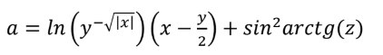
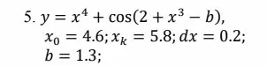
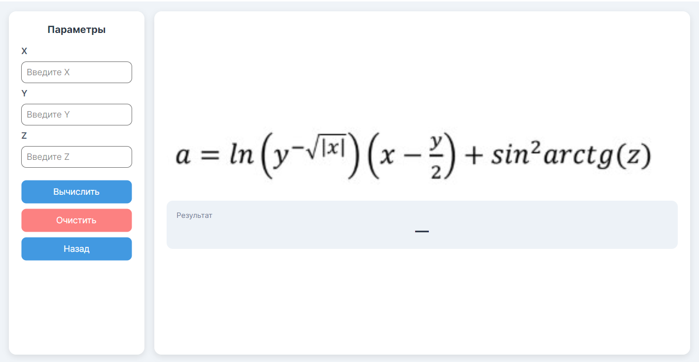
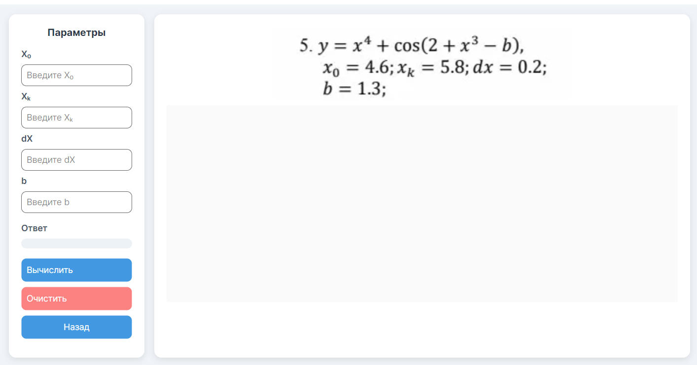

#  Практическая работа №4 — Тестирование «Белым ящиком»

<div align="center">


**Группа:** 3ИСИП323 &nbsp;|&nbsp; **Вариант:** 5

|  Зевакин Д.С. |  Шпилько М.С. |
|:-:|:-:|

</div>

---

##  Цель работы

Приобрести практические навыки ручного тестирования методом **«белого ящика»** путём разработки графического приложения с тремя математическими функциями.

---

##  Вариант 5 — Математические функции

### Функция 1 (Страница 1)




### Функция 2 (Страница 2)


### Функция 3 (Страница 3)




---

##  Структура проекта

```
ПрактическаяРабота4_Зевакин_Шпилько/
│
├──  Images/
│   ├── 123.jpg
│   ├── 2344.png
│   └── photo_5219688800559240458_x.jpg
│
├──  Pages/
│   ├── FirstFunction.axaml       # Страница 1 — Функция 1
│   ├── FirstPage.axaml           # Главная страница навигации
│   ├── Messagebox.axaml          # Диалоговые окна
│   ├── SecondFunction.axaml      # Страница 2 — Функция 2
│   └── ThirdFunction.axaml       # Страница 3 — Функция 3 + График
│
├── App.axaml                     # Точка входа приложения
├── App.axaml.cs
├── app.manifest
├── MainWindow.axaml              # Главное окно
└── Program.cs
```

---

##  Скриншоты приложения

###  Страница 1 — Вычисление a




---

###  Страница 2 — Функция e(i, x)


---

###  Страница 3 — Вычисление y + График




---

##  Запуск проекта

### Требования

- [.NET 9 SDK](https://dotnet.microsoft.com/download/dotnet/9.0)
- IDE: [JetBrains Rider](https://www.jetbrains.com/rider/) / [Visual Studio 2022](https://visualstudio.microsoft.com/) / [VS Code](https://code.visualstudio.com/)

### Установка и запуск

```bash
# Клонировать репозиторий
git clone <https://github.com/Sc0pPP/PracticalWork4_Zevakin_Shpilko>

# Перейти в папку проекта
cd ПрактическаяРабота4_Зевакин_Шпилько

# Восстановить зависимости
dotnet restore

# Запустить приложение
dotnet run
```

---

##  Технологии

| Технология | Назначение |
|:---:|:---|
| **Avalonia UI** | Кроссплатформенный UI-фреймворк |
| **.NET 9** | Платформа выполнения |
| **C#** | Язык программирования |
| **AXAML** | Разметка интерфейса |
| **MVVM** | Архитектурный паттерн |


---

## Полезные ссылки

-  [Руководство по разметке GitVerse](https://gitverse.ru/docs/collaborative/repositories/reference/markup-guide/)
-  [Документация Avalonia UI](https://docs.avaloniaui.net/)
-  [Документация .NET 9](https://learn.microsoft.com/ru-ru/dotnet/)

---

<div align="center">

*Практическая работа №4 · Группа 3ИСИП323 · 2025–2026*

</div>
